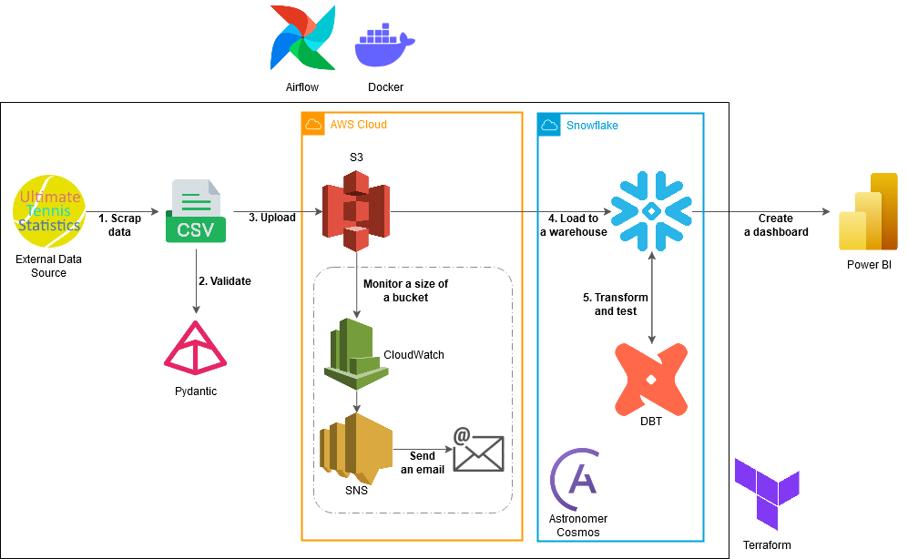

#  Ultimate Tennis Statistics End-To-End ELT Pipeline

Pipeline that extracts data from [Ultimate Tennis Statistics](https://www.ultimatetennisstatistics.com/) Player database and transforms it for a Power BI Dashboard.

## Overview

## Data Visualization

## Architecture

Infrastructure was provisioned using Terraform, containerized with Docker, and orchestrated via Airflow. The Astronomer Cosmos package was utilized to simplify building dbt models and tests as Airflow tasks. A dashboard was created using Power BI.

## Prerequisites

- Unix-like system or [WSL](https://learn.microsoft.com/en-us/windows/wsl/install)
- [AWS CLI](https://aws.amazon.com/cli/)
- [Snowflake CLI](https://docs.snowflake.com/en/developer-guide/snowflake-cli/installation/installation)
- [Astro CLI](https://www.astronomer.io/docs/astro/cli/install-cli/), required for DBT Core and Airflow integration
- [Terraform](https://www.terraform.io/), required to provision AWS and some of the Snowflake services
- [Docker](https://www.docker.com/), required to run the pipeline in Airflow
- Installed packages from `/requirements.txt`

## How to Run This Project

1. Run `make aws` (enter your access keys and region name).
    
2. Initialize the Terraform environment with `make init`.

3. Run `make dotenv` (creates */vars.env* file and configures the Snowflake connection).

4. Execute `export $(cat vars.env | xargs)` (uses the *vars.env* file as environment variables).

5. Run `make profile` (adds a DBT profile with your Snowflake credentials as environment variables).

6. Execute `make sf` (creates the Snowflake infrastructure).

7. Run `make apply` and enter your e-mail address for Cloudwatch alarm (you can leave it empty) (creates AWS infrastructure and Snowflake storage integration).

8. Run `make files` (generates *airflow_settings.yaml* and *docker-compose.override.yml* with confidential values from environment variables).

9. Run `make airflow`.

10. Run *main_dag* inside the Airflow UI.

## Lessons Learned 

During the development of this ELT project, I gained several valuable insights:  

1. **Overriding Terraform Resources with Remote State**  
    I learned how to effectively override Terraform resources using a remote state. This was essential because the project required creating AWS resources first, followed by Snowflake resources. The Snowflake configurations depended on properties from AWS resources, and the IAM trust policy needed attributes from the integration that was only available after policy creation. Without remote state management, this would have led to a continuous dependency cycle.  

2. **The Importance of Data Validation**  
   Validating data is a critical step in the data lifecycle. It ensures errors in the dataset are identified early, reducing debugging time and minimizing unnecessary cloud processing costs.

3. **Using Docker Volumes for Confidential Files**  
   I discovered that Docker volumes provide a secure way to manage confidential files within containers.

What I Would Do Differently:  

1. **Considering Redshift Instead of Snowflake**  
    Redshift could have been a more cost-effective solution and potentially easier to integrate. With Snowflake, I had to create additional resources such as storage integrations and a stage. However, I opted for Snowflake due to its more generous free trial period.  

2. **Improving Environment Variable Management**  
   The method I used for loading environment variables, the `export $(cat vars.env | xargs)` command, posed limitations due to its temporary scope and potential security risks.

## Contact

Please feel free to contact me if you have any questions at [Linkedin](https://www.linkedin.com/in/kkborowy/) or email me at [kkborowy@gmail.com](mailto:kkborowy@gmail.com)! c: